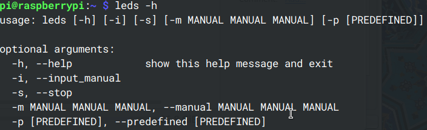

# Raspberry Pi Leds Setup
## Cli
### Usage

Running application with no parameters results in sending an X11 window from the remote host (provided that ssh was run with an `-X` option), which allows for selecting the preferable colour:

### Features
- added bash tab completion on -p colours command:`leds -p <TAB>`
