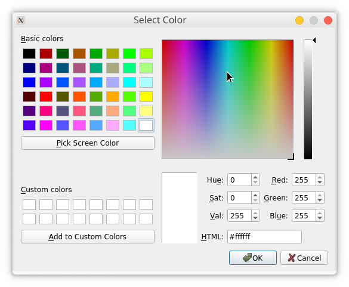
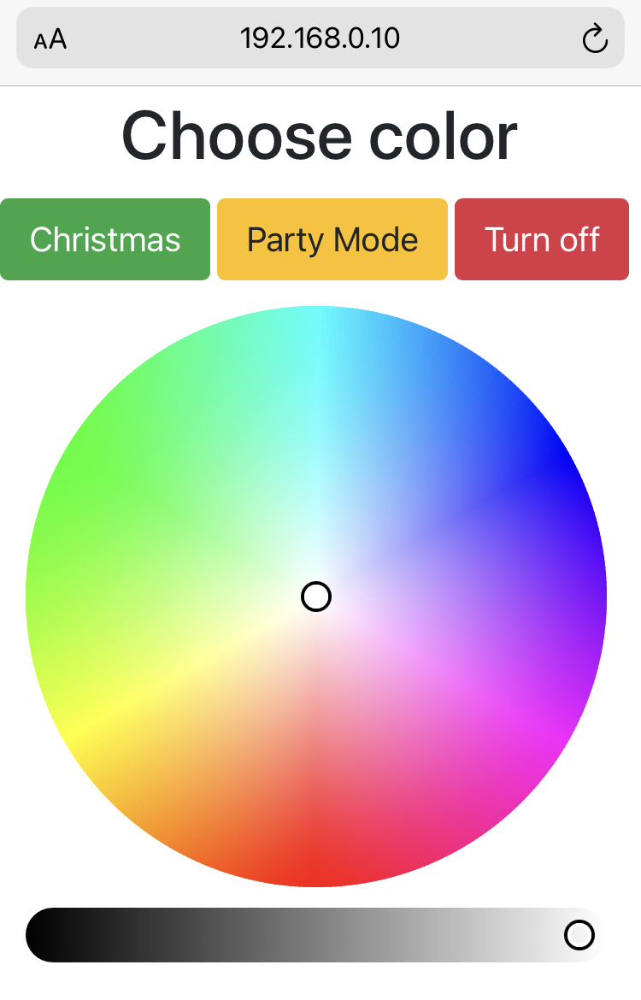

# Raspberry Pi Leds Setup
## cli
### Usage

```bash
pi@raspberrypi:~ $ leds -h
usage: leds [-h] [-i] [-s] [-m MANUAL MANUAL MANUAL] [--hex HEX]
            [-p [PREDEFINED]]

optional arguments:
  -h, --help            show this help message and exit
  -i, --input_manual
  -s, --stop
  -m MANUAL MANUAL MANUAL, --manual MANUAL MANUAL MANUAL
  --hex HEX
  -p [PREDEFINED], --predefined [PREDEFINED]
```
Running application with no parameters results in sending an X11 window from the remote host (provided that ssh was run with an `-X` option), which allows for selecting the preferable color:

### Installation
To install, simply run `sudo ./install.sh` - root privileges are required to add the `leds` script to the `/usr/local/bin/` path and the config file to `bash_completion.d` directory.
### Bash completion
Cli supports bash tab completion on `-p color` command:`leds -p <TAB>`.

Colors defined in the colors.conf file, at /home/pi/.config/leds/favcolors.conf will be autocompleted with the usage of [bash completions](https://github.com/scop/bash-completion).

Colors specified in the colors.conf config file should follow the specified below convention: 
```
color R G B    # R,G,B in range of 0-255

#example
violet 74 0 79
```
Colors can be separated by `,` or the list of colors enclosed with `[]` - such characters will be ommited by the cli script. 

---
## WebUI
### Usage
Run the command via `node index.js`.

Enter the Raspberry Pi IP address (or hostname, if you have DNS server configured) and select the desired color.



### Configuration of the NodeJS app
#### Enable running the app as daemonized and upon system startup
1. Install PM2 node module globaly `sudo npm install -g pm2`
2. Start the app with PM2 `pm2 start index.js`
From here on out the app should run as daemonized and additionally, it will restart upon crash. 
3. The `pm2 startup` command will generate a script that will lunch PM2 on boot together with the applications that you configure to start.
```bash
pm2 startup systemd
```
4. Copy the generated command and run it.
```bash
sudo env PATH=$PATH:/usr/bin /usr/lib/node_modules/pm2/bin/pm2 startup systemd -u pi --hp /home/p
```

This created a system unit that will start PM2 on boot. When the system will boot PM2 will resurrect from a dump file that is not created yet. To create it run `pm2 save`. This will save the current state of PM2 (with app.js running) in a dump file that will be used when resurrecting PM2.


#### Reverse Proxy setup
Nginx is used as a reverse proxy server to redirect all the traffic to/from port `80` to the application, on port `8000`.

1. Install nginx:
```bash
sudo apt update
sudo apt install nginx
```
2. Configure the reverse proxy server config, located at `/etc/nginx/sites-available/default` in the following way:
```bash
server {
        listen 80 default_server;
        listen [::]:80 default_server;

        root /var/www/html;

        index index.html index.htm index.nginx-debian.html;

        server_name _;

        location / {
            proxy_pass http://localhost:8000;
            proxy_http_version 1.1;
            proxy_set_header Upgrade $http_upgrade;
            proxy_set_header Connection 'upgrade';
            proxy_set_header Host $host;
            proxy_cache_bypass $http_upgrade;
        }
}
```
3. Test the integrity of the file via running `sudo nginx -t`. If successful, restart the Nginx server `sudo systemctl restart nginx`.
---
## Future improvements
- add `turn off` button in the web UI
- add favourites to the web UI
- add save to favourites to the web UI
## References
[Run your Node.js application on a headless Raspberry Pi - dev.to article](https://dev.to/bogdaaamn/run-your-nodejs-application-on-a-headless-raspberry-pi-4jnn)